  

# 🚀 Awesome Virtual Machine Migration Ecosystem

     

> 📦 **A curated ecosystem guide of SaaS platforms, enterprise tools, and open-source software for Virtual Machine (VM) migration, V2V (Virtual-to-Virtual) conversion, cloud workload mobility, hypervisor migration (VMware to KVM/Incus), and zero-downtime disaster recovery.**

---

## 📌 Overview

This repository tracks notable **commercial VM migration platforms** and **open-source projects** that move virtual machines across hypervisors, cloud providers, and on-premises infrastructure. These solutions automate disk format conversion (VMDK, QCOW2, VHDX), VirtIO driver injection, network reconfiguration, and cutover orchestration — helping organizations eliminate vendor lock-in, transition from VMware vSphere, execute cloud-to-cloud transfers, and modernize cloud virtualization stacks.

---

## 📑 Table of Contents

- [🏢 SaaS & Commercial Migration Platforms](#-saas--commercial-migration-platforms)
- [🔓 Open-Source GitHub Projects](#-open-source-github-projects)
- [🛠️ Migration Frameworks & Driver Tools](#%EF%B8%8F-migration-frameworks--driver-tools)
- [🤝 How to Contribute](#-how-to-contribute)
- [⚠️ Enterprise Migration Disclaimer](#%EF%B8%8F-enterprise-migration-disclaimer)
- [💖 Support & Sponsorship](#-support--sponsorship)
- [⭐ Star History](#-star-history)

---

## 🏢 SaaS & Commercial Migration Platforms

> 📊 **Market Dynamics**: The global cloud and VM workload migration market size is estimated at **$15.2 Billion in 2026** (growing at ~24.5% CAGR). The market is **moderately fragmented**, featuring dominant cloud hyper-scalers alongside established enterprise backup/disaster recovery giants and specialized workload mobility providers.

| 🏢 Platform | 💰 Pricing Model (Starting Tier) | 🎁 Free Tier Limit / Trial | 📈 Market Cap / Valuation / Revenue | 📝 Key Capabilities |
| :--- | :--- | :--- | :--- | :--- |
| **[Microsoft Azure Migrate](https://azure.microsoft.com/en-us/products/azure-migrate/)** ⚡ | Free tool usage (pay only for consumed Azure compute/storage) | 💵 $200 free credit (30 days) + 55+ services always free | **$3.12 Trillion** *(Market Cap)* | Agentless VMware, Hyper-V, and AWS/GCP migration hub with cost estimation & dependency mapping. |
| **[AWS Server Migration Service / MGN](https://aws.amazon.com/server-migration-service/)** ☁️ | Free for 90 days per server (then $0.04/hr per replicating server) | ⏱️ 90 days free per server replicated to AWS | **$2.35 Trillion** *(Amazon Market Cap)* | Agentless continuous block-level replication from vSphere/Hyper-V/Azure live to EC2. |
| **[Google Migrate for Compute Engine](https://cloud.google.com/migrate/compute-engine)** 🌐 | Free tool usage (pay only for GCP target resources) | 💵 $300 free credit (90-day trial) | **$2.08 Trillion** *(Alphabet Market Cap)* | Streaming replication with test clone capabilities for pre-cutover validation in GCP. |
| **[Veeam Backup & Replication](https://www.veeam.com/)** 🛡️ | ~$180/year per workload (Veeam Universal License pack) | 🎁 Veeam Community Edition (Free up to 10 workloads forever) | **$1.50 Billion** *(Annual Revenue / ~$12B Valuation)* | Enterprise backup & instant recovery with cross-hypervisor VM restore (vSphere to Hyper-V/KVM). |
| **[Commvault Cloud](https://www.commvault.com/)** 💾 | ~$100/month per VM (SaaS protection & migration tier) | ⏱️ 30-day full-featured free trial | **$7.20 Billion** *(Market Cap)* | Unified enterprise data management, multi-cloud mobility, and automated VM migration. |
| **[Nutanix Move](https://www.nutanix.com/products/move)** 🔄 | Free for Nutanix AOS customers (bundled with platform) | 🎁 Included free with Nutanix AHV/AOS license | **$14.80 Billion** *(Market Cap)* | Agentless VM migration from ESXi, Hyper-V, and AWS to Nutanix AHV with automatic driver injection. |
| **[Zerto](https://www.zerto.com/)** ⚡ | ~$85/year per protected VM | ⏱️ 14-day enterprise free trial | **$1.20 Billion** *(Acquired by HPE for $1.4B)* | CDP (Continuous Data Protection) standard for low-RPO disaster recovery & live multi-cloud migration. |
| **[Carbonite Migrate](https://www.carbonite.com/migrate/)** 🔁 | ~$499/migrated server license | ⏱️ 30-day evaluation trial | **$800 Million** *(Parent OpenText ~$8B Valuation)* | Byte-level real-time continuous replication for physical, virtual, and cloud workloads with minimal cutover downtime. |
| **[PlateSpin Migrate](https://www.microfocus.com/en-us/products/platespin-migrate/overview)** 🖥️ | ~$350 per server migration license | ⏱️ 30-day evaluation trial | **$600 Million** *(OpenText Enterprise Workload Unit)* | Heterogeneous server workload migration across physical, VMware, Hyper-V, and public clouds. |
| **[CloudEndure Migration](https://www.cloudendure.com/)** 🚀 | Free for AWS target migration (AWS native tool) | ⏱️ Free 90-day license per server for AWS migration | **Part of AWS** *(AWS ~$110B Annual Revenue)* | Block-level continuous live replication engine for mass migration to AWS. |

---

## 🔓 Open-Source GitHub Projects

Below is the list of top open-source VM migration tools, hypervisor managers, and V2V conversion engines, sorted by **GitHub Star Count** (descending).

| 📦 Repository / Project | ⭐ GitHub Stars | 📜 License | 🎯 Primary Use Case & Highlights |
| :--- | :---: | :--- | :--- |
| **[KubeVirt](https://github.com/kubevirt/kubevirt)** ☸️ |  | Apache-2.0 | **Kubernetes Native VM Management**: Runs virtual machines alongside containers with built-in live migration support. |
| **[Harvester](https://github.com/harvester/harvester)** 🌾 |  | Apache-2.0 | **Open Source HCI**: Built on KubeVirt and Longhorn, features native VM import and migration from VMware vSphere. |
| **[OpenStack Nova](https://github.com/openstack/nova)** ☁️ |  | Apache-2.0 | **Cloud Compute Fabric**: Enterprise live migration engine with parallel memory streaming and vTPM migration support. |
| **[oVirt Engine](https://github.com/ovirt/ovirt-engine)** 🔴 |  | ASL 2.0 | **KVM Virtualization Management**: Enterprise virtualization suite with V2V import service and cross-host live migration. |
| **[virt-v2v](https://github.com/libguestfs/virt-v2v)** 🛠️ |  | GPL-2.0 | **The Golden Standard V2V Converter**: Converts VMware/Xen/Hyper-V guests to KVM with automated VirtIO driver injection and bootloader fixes. |
| **[Coriolis](https://github.com/cloudbase/coriolis)** 🌀 |  | Apache-2.0 | **Cloud-to-Cloud Migration as a Service**: Migrates VMs, storage, and networks between vSphere, SCVMM, AWS, Azure, OpenStack, & GCP. |
| **[xmigrate](https://hub.docker.com/r/xmigrate/xmigrate)** 🚚 |  | CC BY-NC-ND | **DC & Cloud Migration Framework**: Agentless discovery and migration engine targeting AWS, GCP, and Azure using FastAPI & Ansible. |
| **[Migration Manager](https://github.com/FuturFusion/migration-manager)** 🔀 |  | Apache-2.0 | **VMware to Incus Migration Hub**: Modern Web UI, REST API, and CLI for batch-migrating ESXi virtual machines to Incus containers/VMs. |
| **[OpenNebula OneSwap](https://github.com/OpenNebula/one-swap)** 🔄 |  | Apache-2.0 | **In-Place VMware to KVM Conversion**: Performs zero-copy disk morphing on datastores without needing massive local staging storage. |
| **[h2kvm](https://github.com/zyvorai/h2kvm)** ⚡ |  | GPL-3.0 | **VDDK-Free VMware to KVM Toolchain**: Migrates guests via vSphere API & NFS with offline GRUB/VirtIO guest repair before boot. |
| **[hyper2kvm](https://github.com/ssahani/hyper2kvm)** 🚀 |  | LGPL-3.0 | **Kubernetes-Native Migration Toolkit**: Production-ready operator with Helm charts, Prometheus metrics, and Rust guest disk inspection. |
| **[EuroMigrator Engine](https://hub.docker.com/r/euromigrator/engine)** 🇪🇺 |  | Open-Source | **Sovereign EU Cloud Migrator**: AI-assisted migration planning from AWS/Azure to European sovereign cloud providers (GDPR compliant). |

---

## 🛠️ Migration Frameworks & Driver Tools

When building custom hypervisor migration pipelines, the following low-level utilities and open-source drivers are recommended:

- **[Libvirt / QEMU Live Migration](https://ubuntu.com/server/docs/explanation/virtualisation/live-migration/)** ⚙️ — Memory & CPU state streaming protocol between KVM hosts.
- **[virt-p2v](https://libguestfs.org/virt-p2v.1.html)** 🖥️ — Bootable ISO/PXE client for physical-to-virtual (P2V) machine conversions.
- **[Proxmox VE Import Wizard](https://pve.proxmox.com/wiki/Performance_Tuning#VM_Migration)** 🦊 — Integrated ESXi storage import wizard for Proxmox hypervisors.
- **[GuestKit](https://github.com/ssahani/hyper2kvm)** 🦀 — Pure-Rust VM disk inspection tool for offline pre-migration diagnostic checks.
- **[Transiva](https://github.com/akutz/transiva)** 📦 — VMware NFC-based disk export driver operating without proprietary VDDK binaries.

---

## 🤝 How to Contribute

Contributions are welcome! Follow these steps to submit new SaaS platforms or open-source projects:

1. 🍴 **Fork** this repository.
2. 📝 **Edit** `README.md` to add your item (ensure tables remain sorted cleanly).
3. 🔗 **Include**: Exact product name, pricing structure, free limits, valuation/stars, and hypervisor support.
4. 📬 **Open a Pull Request** with a brief summary of the added platform.

---

## ⚠️ Enterprise Migration Disclaimer

- 🧪 **Test in Staging**: Always run test cutovers in isolated VLANs. Missing VirtIO drivers or UEFI/GPT mismatch can cause Windows BSOD `INACCESSIBLE_BOOT_DEVICE` or Linux GRUB panic.
- 🚫 **VMware VDDK Update**: Public VMware VDDK downloads ended in September 2026. Migration tooling should leverage NFS, HTTPS, or vSphere API transport paths.
- 🔒 **Windows Server 2025 Guest Readiness**: Moving Windows Server 2025 to KVM requires `q35` machine type, UEFI boot, and WHQL-signed VirtIO driver packages.

---

## 💖 Support & Sponsorship

Thank you for exploring the Virtual Machine Migration Ecosystem repository! If you find this curated collection helpful for your cloud architecture, DevOps, or hypervisor migration projects, please consider supporting the project:

- ⭐ **Star this repository** to help others discover it.
- 🔀 **Fork and contribute** to keep the dataset updated.
- 📢 **Share** with your network and team.
- ☕ **Buy me a coffee**: Support ongoing maintenance on the [GitHub Sponsor Dashboard](https://github.com/sponsors/ishandutta2007).

---

## ⭐ Star History

---

  <b>Maintained with ❤️ for Cloud Architects, DevOps Engineers, and System Administrators.</b>

